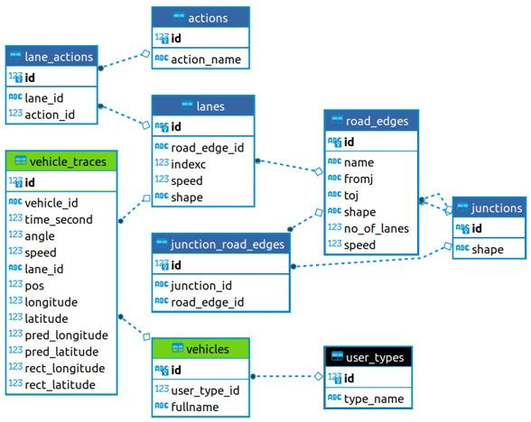

# Overview (Rectification of Kalman filter based location predictions)
This repository contains the necessary code to rectify the predicted vehicular locations based on a modified Kalman filter. The rectification process is made road aware by the use of a lane-shape, which improves the accuracy of predicted geo-coordinate. The geo-coordinates, i.e., long. and lat., were used instead of x and y coordinates. Several mathematical concepts were embedded into the Kalman filter and the Rectification process.

**Note**: All of the code is open source and free to use.  <!-- The code for this work will be uploaded to GitHub (asifgit) after the research-article submission is accepted. -->
If anyone of you is interested, please drop a question or email me at malikasifmahmoodawan@gmail.com.

## Rectification


## vTracheaStore


# Software/Prerequisites (required)
- Software to be downloaded and installed:
  - PostgreSQL (version: 14.5) - [link](https://www.enterprisedb.com/downloads/postgres-postgresql-downloads "click to download!")
  - Anaconda (version: 3) - [link](https://repo.anaconda.com/archive/Anaconda3-2022.05-Windows-x86_64.exe "click to download!")
- If you're unable to find the files on GitHub, download the `files` / `fodlers` from here:
  - Database (vTracheaStore) - [link](https://drive.google.com/drive/folders/16MBugighC5pNmLLdyrHLhqAaC9EGKTqi "click to download!")
  - Conda environment (virtual environment) - [link](https://drive.google.com/drive/folders/1kZU1ue0PVcKzip1dJkL_BDRJA4o_3yPV "click to download!")
  - Jupyter notebooks (`rectification` code) - [link](https://drive.google.com/drive/folders/1PMiASfwVRIb0NwdgMDnD6l6EmMvIPJHi "click to download!")

# Importing the vTracheaStore database
Run following `cmd` / `terminal` commands to import the database in `PostgreSQL`. We used `postgres` as the value of `username_of_database`:
```cmd
psql -U username_of_database
```

In the `psql` shell, create an empty database named as `vTracheaStore` as follows
```cmd
CREATE DATABASE vTracheaStore;
```

The above command will take you to the `PostgreSQL` shell. Run the following command to import the downloaded vTracheaStore as follows. We used `E:\Akraino-ETSI-MEC-Hackathon\vTracheaStore\vTracheaStore.pgsql` as the value of `file_path_of_the_downloaded_pgsql_script.pgsql`:
```cmd
\i file_path_of_the_downloaded_pgsql_script.pgsql
```
Hurray, you have successfully imported the `vTracheaStore` database.

# Create a virtual environment
Now that the database is ready, we require you to setup the virtual environment in `anaconda` for running the `jupyter notebooks`. In order to do so, run the following commands in `cmd` / `terminal`. We used `E:\Akraino-ETSI-MEC-Hackathon\Environments\rectificationEnvironment.yml` as the value of `file_path_of_the_downloaded_yml.yml`: 
```cmd
conda env create -f file_path_of_the_downloaded_yml.yml
```

Once the `conda` environment is setup, run the following commands to enter into that virtual environment that we just created, and then launch the `jupyter notebook`:
```
conda activate etsimeclfedgehackathon2022
```

Once you entered into the environment, you are ready to launch the `jupyter notebook`. Just be sure to run the next `command` in the correct directory where the jupyter notebook exists. Otherwise, you won't be able to see the jupter notebook on your browser at `localhost:8888`. The command is:
```cmd
jupyter notebook
```

# Run the Jupyter notebook for running the tests
Now, we are ready to run the `modified kalman filter` functions which enable the prediction of vehicle trajectories. These trajectories are loaded from the `vTracheaStore` database, which are then processed by the `rectification`-assisted modified kalman filter. These `predicted` and `rectified` vehicle coordinates `longitude`, `latitude` are then stored back in the `vTracheaStore`. Based on the tests, we then evaluate the `predicted` and `rectified` numerically as well as visually. 

# Conclusion:
The `rectification`-assisted location prediction significantly enhances the performance of kalman filter location prediction. This solution uses the road/lane coordinates to rectify the predicted location, which we stored in the `vTracheaStore`.
